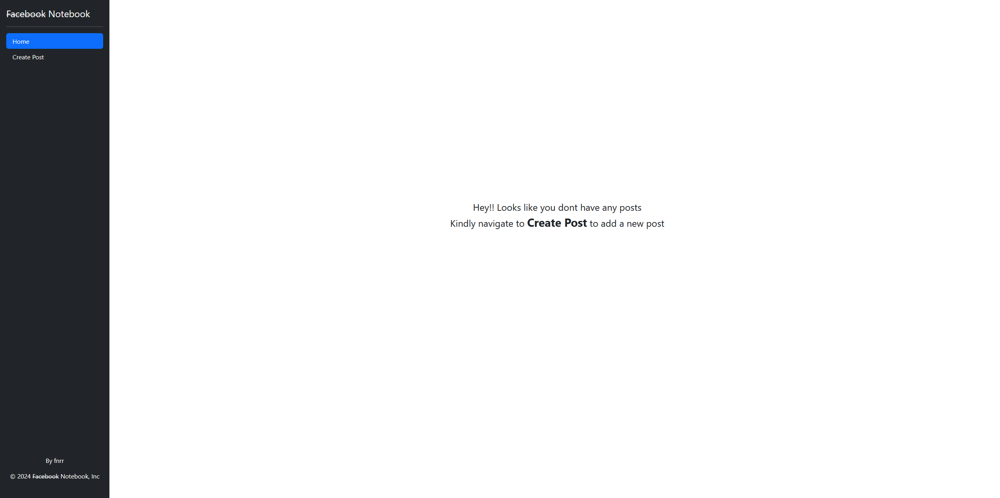
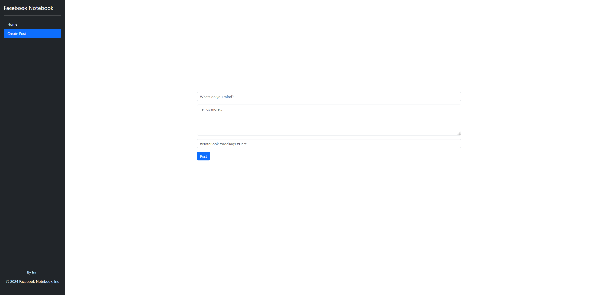
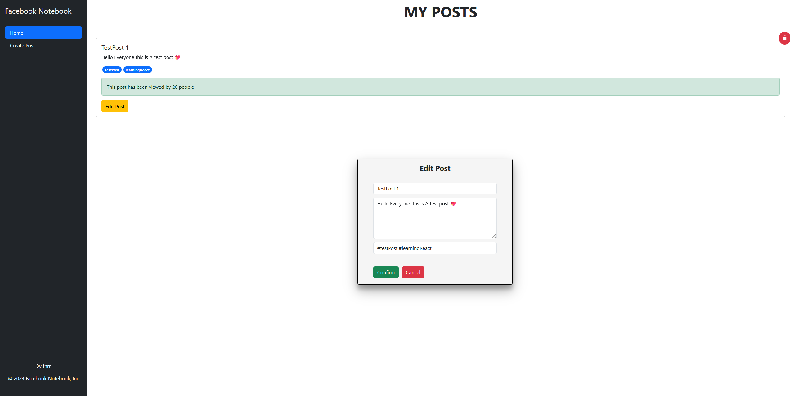

# React-PostIt-App

A React-based front-end application that allows you to Create, View and Edit your posts. Built with modern React features and styled with Bootstrap

## Screenshots

### Home Page

### Create Post

### Edit Post

## Features

- Create new posts
- View all posts
- Edit existing posts
- Delete posts

## Technologies Used

- React
- Bootstrap
- Custom CSS
